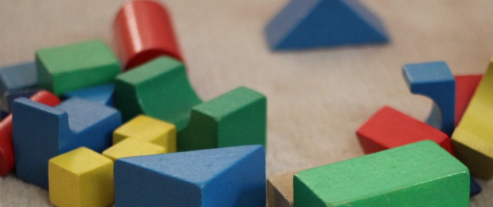
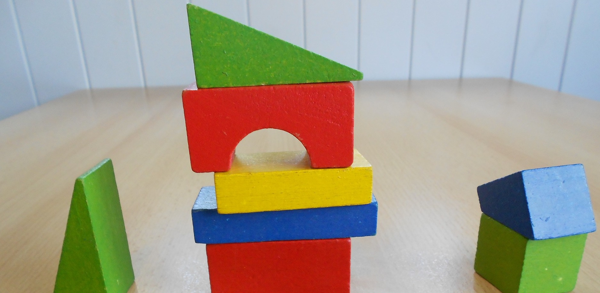

```{r, message=FALSE, echo=FALSE}
library(knitr)
opts_chunk$set(collapse = TRUE)
```


---- 

Think of a data structure (also called objects or variables) as container to hold a value.  Containers are defined to hold specific types of values and we can give them informative names.  In any programming language, all data structures are built from the ground up using basic building blocks.



---- 

In R, the most frequently used are:

> * logical
> * integer 
> * double (numeric)
> * character

---- 



From these we build increasingly complex data structures, adapted to hold whatever type of data we are interested in. 

---- 

For example a DESeq object, used in analzying RNA-seq data contains the expression data, additional annotations on the genes, sample data, experiment details and results from any statistics run.

Objects are used to structure data and reduce repetition.  They are passed to functions and can be modified.


